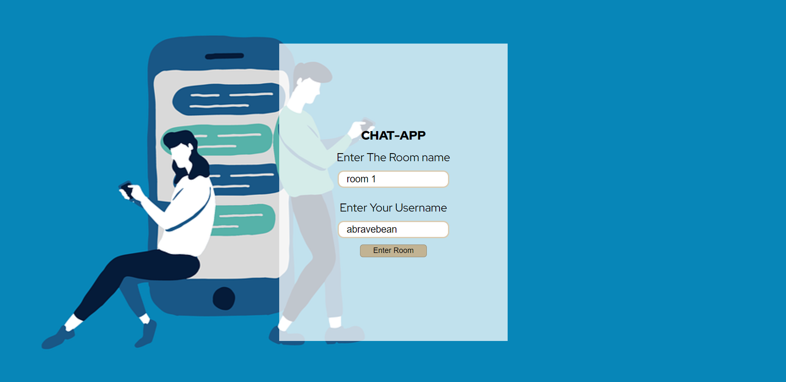
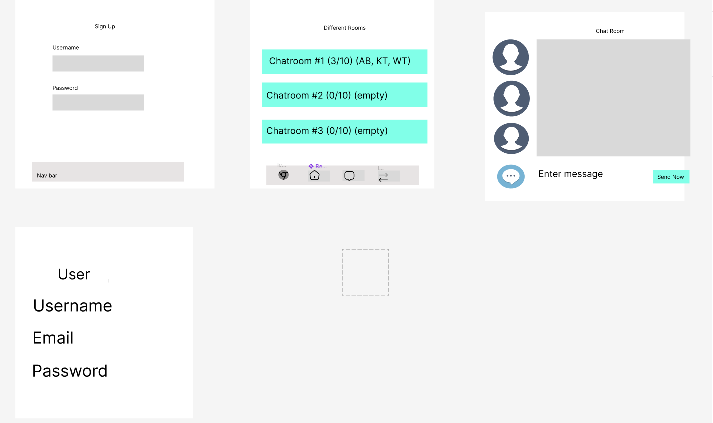

# A real-time ChatApp
This project is about building real-time communication features for users.

## Team members
* Product Manager: Winston Tang
* Repo Owner: An Bui
* Frontend Lead: Kevin Tran
* Backend Lead: An Bui
## live link https://letschattogether.netlify.app/
## repo
#### Backend: [https://github.com/anbee123/chatapp-backend-.git](https://github.com/anbee123/chatapp-backend-.git)
#### Frontend:[https://github.com/anbee123/chatapp-frontend.git](https://github.com/anbee123/chatapp-frontend.git)

## Wireframe

### Technologies Used

* Django
* PostgreSQl
* Full CRUD
* React

## how to use the app

* As a user, you should be able to log-in in to the app
* Add after succesfully logged in, choose a room to chat
 
 ## future enhancements
 * allow user to login / logout
 * authentication for user to register / login / logout
 * using Websocket.IO for app to be real-time chat app
 * create group chat
 * set avatar for each user
 
 ## Trello board 
 [live link](https://trello.com/b/Ep2395qR/project-4)
 
 
 ## Model ERD
 

 
 
